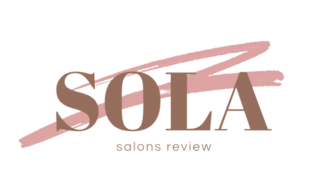

# SOLA

  
<!-- PROJECT LOGO -->
  

<!-- PROJECT LOGO -->
 

# About the Project

## Introduction
Every girl in Riyadh would like to treat herself in the best way possible. These days and with the increased number of
salons, ladies are struggling to find the one that match their needs and expectations, which may victimize their beauty
to deficient salons.
Since nowadays technology has proven that it's the best way to bring people together. We designed Sola website to
enable ladies all around Riyadh city to share their experiences with different salons, to ensure that everyone knows the
level of quality they'll be receiving

### Built With
<!-- technology -->

* 
* 
* 

